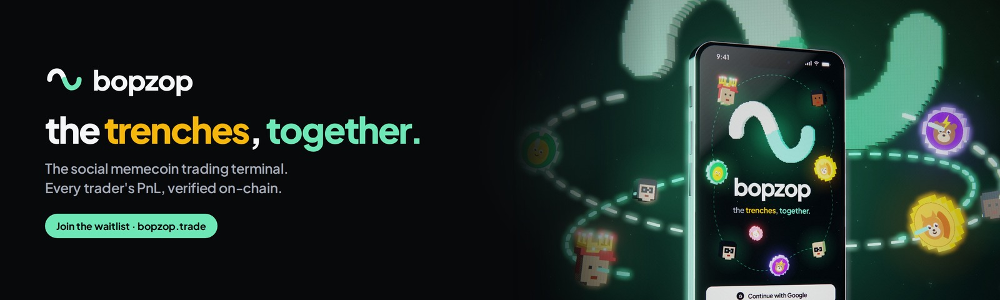
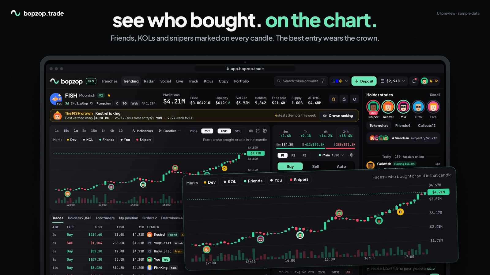
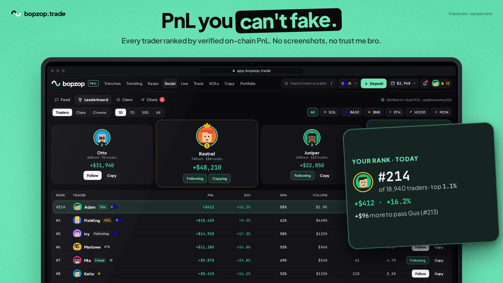

### Hi, I'm Adam

I'm the founder of **[bopzop](https://bopzop.trade)**, the social memecoin trading terminal.

On bopzop, every trader's PnL and calls are tied to real on-chain trades. You follow people whose wins are real, not screenshots.

I'm building it as a non-technical founder, with a team of AI coding agents shipping in parallel.

#### What bopzop does

- **Verified PnL.** Profiles, leaderboards and calls backed by on-chain trades.
- **The trenches, together.** New launches, with your friends' buys on every token.
- **Faces on the chart.** See where friends, KOLs and snipers bought or sold.
- **Copy trading with limits.** Follow the traders who actually win, inside the limits you set.
- **Embedded wallets.** Sign in with Google, X, email, a wallet or a passkey.

**Status:** private beta October 15, 2026 · public launch October 22, 2026 · Solana first.

**Built with:** Solana · Privy · Jupiter · QuickNode · Cloudflare

UI preview · sample data. The bopzop codebase is private for now.

#### Open source

- [github.com/Riaddahhab/adam](https://github.com/Riaddahhab/adam) — **bopzop open source**: `pixel-traders` (the pixel people of bopzop, [live demo](https://riaddahhab.github.io/adam/)) and `solana-swap-pnl` (realized/unrealized PnL of a Solana wallet). The bopzop app itself is closed source.

#### Find me

- Waitlist: [bopzop.trade](https://bopzop.trade)
- X: [@TraderDahhan](https://x.com/TraderDahhan) · [@bopzopapp](https://x.com/bopzopapp)
- LinkedIn: [Adam Dahhan](https://www.linkedin.com/in/adam-dahhan-1b813a26b)
